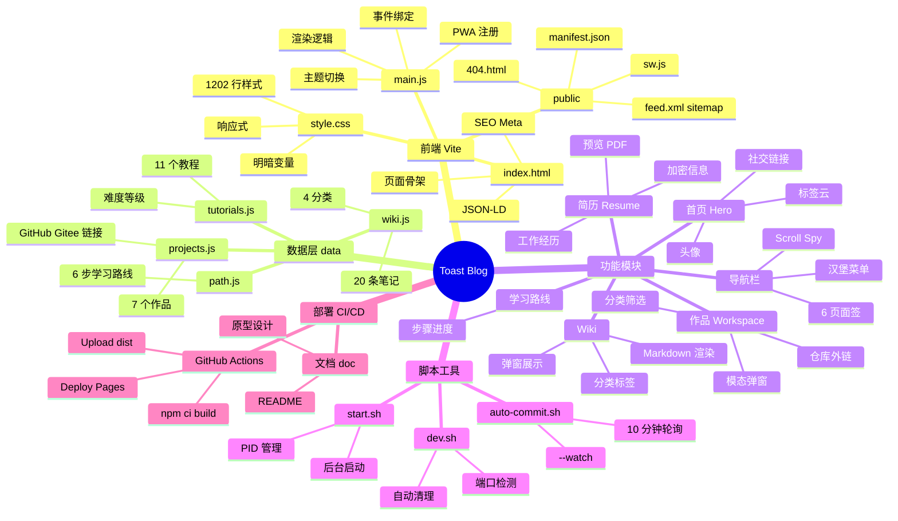

# 🍞 Toast Blog

> 个人技术博客 · 作品集 · 知识库  
> Personal Tech Blog · Portfolio · Knowledge Base

<p align="center">
  
  
  
  
  
  
  
</p>

---

## 📋 目录 | Table of Contents

- [🇨🇳 中文说明](#-中文说明)
- [🇬🇧 English](#-english)
- [🏗️ 项目架构 | Architecture](#️-项目架构--architecture)
- [🧠 思维导图 | Mind Map](#-思维导图--mind-map)
- [⚙️ 运行环境 | Runtime](#️-运行环境--runtime)
- [🚀 启动脚本 | Scripts](#-启动脚本--scripts)
- [📐 迭代需求 | Iterations](#-迭代需求--iterations)
- [📅 开发计划 | Roadmap](#-开发计划--roadmap)
- [🧰 开发工具 | Dev Tools](#-开发工具--dev-tools)
- [🤖 AI 辅助工具 | AI Tools](#-ai-辅助工具--ai-tools)
- [🧪 测试工具 | Testing](#-测试工具--testing)
- [🌐 演示环境 | Demo](#-演示环境--demo)
- [📂 目录结构 | Structure](#-目录结构--structure)
- [📸 截图预览 | Screenshots](#-截图预览--screenshots)
- [📜 更新日志 | Changelog](#-更新日志--changelog)
- [🤝 贡献 | Contributing](#-贡献--contributing)

---

## 🇨🇳 中文说明

**Toast Blog** 是一个个人技术博客与作品集网站，使用 **Vite 6 + 原生 JavaScript** 构建，零框架依赖。展示个人简历、开源作品、技术教程、知识笔记（Wiki）和学习路线。

### 核心功能

| 功能 | 说明 |
|------|------|
| 📄 个人简历 | 加密信息保护（姓名/电话/学院/公司），一键预览 & 导出 PDF |
| 🗂️ 作品展示 | 7 个开源项目，分类筛选，弹窗详情，GitHub / Gitee 外链 |
| 📖 AI 技术教程 | 11 篇教程，涵盖 LLM / RAG / Agent 开发 |
| 📝 Wiki 笔记 | 20 条技术笔记，4 分类 + Markdown 渲染 |
| 🧭 学习路线 | 6 步系统学习路径 |
| 🌗 深色模式 | 明/暗主题切换，localStorage 持久化 |
| 📱 响应式 | 移动端汉堡菜单，触控优化 |
| 🔍 SEO | JSON-LD、OG/Twitter、Sitemap、RSS |
| ⚡ PWA | Service Worker，离线缓存 |
| 💬 评论 | Giscus（GitHub Discussions 驱动） |
| 📊 性能 | Lighthouse 100 / a11y 93 / SEO 100 |
| 🔄 CI/CD | GitHub Actions 自动构建 & 部署到 Pages |

### 技术栈

```
前端：   Vite 6 + 原生 HTML/CSS/JS（零框架）
样式：   纯 CSS + CSS 变量（明暗主题）
图标：   Lucide Icons + Emoji
PDF：    html2pdf.js（CDN）
部署：   GitHub Actions → GitHub Pages
评论：   Giscus（GitHub Discussions）
分析：   Cloudflare Web Analytics
字体：   Inter + JetBrains Mono（Google Fonts）
```

### 隐私保护

简历中的真实姓名、电话、毕业院校、工作单位默认加密显示，点击🔒可切换明文，导出 PDF 时保持加密状态。

---

## 🇬🇧 English

**Toast Blog** is a personal tech blog and portfolio site built with **Vite 6 + vanilla JavaScript** (zero framework dependencies). It showcases resumes, open-source projects, tech tutorials, knowledge notes (Wiki), and learning roadmaps.

### Core Features

| Feature | Description |
|---------|-------------|
| 📄 Resume | Encrypted PII (name/phone/school/company), preview & export PDF |
| 🗂️ Portfolio | 7 projects, category filter, modal detail, GitHub/Gitee links |
| 📖 Tutorials | 11 AI/LLM/RAG/Agent tutorials with difficulty badges |
| 📝 Wiki | 20 technical notes, 4 categories, Markdown rendering |
| 🧭 Learning Path | 6-step systematic learning roadmap |
| 🌗 Dark Mode | Theme toggle, localStorage persistence |
| 📱 Responsive | Hamburger menu, touch optimization |
| 🔍 SEO | JSON-LD, OG/Twitter cards, Sitemap, RSS |
| ⚡ PWA | Service Worker, offline caching |
| 💬 Comments | Giscus (GitHub Discussions) |
| 📊 Performance | Lighthouse 100 / a11y 93 / SEO 100 |
| 🔄 CI/CD | GitHub Actions auto-build & Pages deploy |

### Tech Stack

```
Frontend:  Vite 6 + Vanilla HTML/CSS/JS (zero framework)
Styling:   Pure CSS + CSS Custom Properties (light/dark theme)
Icons:     Lucide Icons + Emoji
PDF:       html2pdf.js (CDN)
Deploy:    GitHub Actions → GitHub Pages
Comments:  Giscus (GitHub Discussions)
Analytics: Cloudflare Web Analytics
Fonts:     Inter + JetBrains Mono (Google Fonts)
```

### Privacy Protection

Resume fields (name, phone, school, company) are encrypted by default. Click 🔒 to toggle visibility. PDF export maintains encryption.

---

## 🏗️ 项目架构 | Architecture

```
┌────────────────────────────────────────────────────────┐
│                   🍞 Toast Blog                        │
│                    Vite Dev Server                     │
├────────────────────────────────────────────────────────┤
│                                                        │
│  ┌────────────────────────────────────────────────┐   │
│  │              index.html (SPA)                    │   │
│  │   ┌──────────┐  ┌──────────┐  ┌─────────────┐  │   │
│  │   │  <head>  │  │  <nav>   │  │  <main>     │  │   │
│  │   │  SEO     │  │  6 tabs  │  │  6 sections │  │   │
│  │   │  Meta    │  │  Scroll  │  │  - Hero     │  │   │
│  │   │  Fonts   │  │  Spy     │  │  - Resume   │  │   │
│  │   │  JSON-LD │  │          │  │  - Workspace│  │   │
│  │   │  Manifest│  │          │  │  - Tutorials│  │   │
│  │   │          │  │          │  │  - Wiki     │  │   │
│  │   │          │  │          │  │  - Learning │  │   │
│  │   └──────────┘  └──────────┘  └─────────────┘  │   │
│  └────────────────────────────────────────────────┘   │
│                                                        │
│  ┌──────────────────┐  ┌────────────────────────┐     │
│  │   main.js        │  │   style.css            │     │
│  │   · 渲染逻辑     │  │   · CSS 变量           │     │
│  │   · 事件绑定     │  │   · 明暗主题           │     │
│  │   · 主题切换     │  │   · 响应式             │     │
│  │   · 骨架屏       │  │   · 动画关键帧         │     │
│  │   · PWA 注册     │  │   · 1202 行             │     │
│  └──────────────────┘  └────────────────────────┘     │
│                                                        │
│  ┌────────────────────────────────────────────────┐   │
│  │              数据层 data/                       │   │
│  │   ┌────────────┐ ┌────────────┐                │   │
│  │   │projects.js │ │tutorials.js│                │   │
│  │   │ 7 个作品    │ │ 11 篇教程  │                │   │
│  │   │ GitHub外链  │ │ 难度等级   │                │   │
│  │   └────────────┘ └────────────┘                │   │
│  │   ┌────────────┐ ┌────────────┐                │   │
│  │   │ wiki.js    │ │ path.js   │                 │   │
│  │   │ 20 条笔记   │ │ 6 步路线  │                │   │
│  │   │ 4 分类      │ │ 完成状态  │                │   │
│  │   └────────────┘ └────────────┘                │   │
│  └────────────────────────────────────────────────┘   │
│                                                        │
│  ┌────────────────────────────────────────────────┐   │
│  │            构建 & 部署 Pipeline                  │   │
│  │                                                  │   │
│  │  npm run build → dist/ → upload-pages-artifact   │   │
│  │                          → GitHub Pages           │   │
│  └────────────────────────────────────────────────┘   │
│                                                        │
└────────────────────────────────────────────────────────┘
```

---

## 🧠 思维导图 | Mind Map



---

## ⚙️ 运行环境 | Runtime

| 环境 | 版本 |
|------|------|
| Node.js | ≥ 18.x |
| npm | ≥ 9.x |
| 浏览器 | Chrome / Firefox / Safari / Edge （最近 2 个主要版本） |
| 构建工具 | Vite 6.x |

### 依赖

```json
{
  "devDependencies": {
    "vite": "^6.3.0"
  },
  "dependencies": {
    "@playwright/test": "^1.61.0"
  }
}
```

---

## 🚀 启动脚本 | Scripts

```bash
# 1. 克隆 & 安装
git clone https://github.com/sml-toast/toast-blog.git
cd toast-blog
npm install

# 2. 开发服务器（端口自动检测 & 冲突清理）
npm run dev
# 或指定端口：bash scripts/dev.sh 5174

# 3. 后台运行（持久化）
bash scripts/start.sh
# 停止：bash scripts/stop.sh

# 4. 构建生产版本
npm run build

# 5. 预览构建产物
npm run preview
```

### 脚本一览

| 脚本 | 说明 |
|------|------|
| `npm run dev` | 开发服务器（自动 404、热更新） |
| `npm run build` | Vite 构建 → `dist/` |
| `npm run preview` | 预览构建产物 |
| `bash scripts/dev.sh [port]` | 端口冲突自动清理 + 启动 |
| `bash scripts/start.sh` | 后台持久运行，PID 管理 |
| `bash scripts/stop.sh` | 停止后台 Vite 进程 |
| `bash scripts/auto-commit.sh` | 一次性自动提交 |
| `bash scripts/auto-commit.sh --watch` | 每 10 分钟轮询自动提交 |

---

## 📐 迭代需求 | Iterations

| 迭代 | 状态 | 核心内容 | 时间 |
|------|------|---------|------|
| **Iter 0: 骨架** | ✅ | Vite 初始化、6 板块 HTML、CSS 变量、导航 | — |
| **Iter 1: MVP** | ✅ | 深色模式、入场动画、返回顶部、ESC 关闭、汉堡菜单 | — |
| **Iter 2: 内容** | ✅ | Wiki 20 条、教程 11 条、作品 7 个、简历数据 | — |
| **Iter 3: 性能** | ✅ | Lighthouse P100、a11y 93、SEO 100 | — |
| **Iter 4: 平台** | ✅ | JSON-LD、Sitemap、RSS、PWA、Giscus、GitHub Actions | — |
| **Iter 5: 迭代** | ✅ | 数据统计、反馈通道、技术栈评估 | — |
| **Iter 6: 增强** | 🔜 | GitHub Pages 修复、动效增强、图片懒加载 | 待定 |

---

## 📅 开发计划 | Roadmap

```mermaid
gantt
    title Toast Blog 开发路线
    dateFormat  YYYY-MM-DD
    axisFormat  %m-%d

    section 基础
    Iter 0: 骨架搭建           :done, i0, 2026-06-01, 2d
    Iter 1: MVP 功能            :done, i1, after i0, 2d

    section 内容
    Iter 2: 内容填充            :done, i2, after i1, 3d

    section 优化
    Iter 3: 性能优化            :done, i3, after i2, 2d
    Iter 4: 平台完善 (SEO/PWA)  :done, i4, after i3, 2d
    Iter 5: 迭代收尾            :done, i5, after i4, 1d

    section 后续
    Iter 6: Pages 修复 + 增强    :active, i6, after i5, 5d
```

### 待办事项 | Backlog

| # | 任务 | 优先级 | 状态 |
|---|------|--------|------|
| 6.1 | GitHub Pages 部署 & 404 修复 | P0 | 🔲 |
| 6.2 | 页面入场/出场动效增强（GSAP） | P2 | 🔲 |
| 6.3 | 图片懒加载（IntersectionObserver） | P2 | 🔲 |
| 6.4 | 搜索功能 | P3 | 💡 |
| 6.5 | 标签云页面 | P3 | 💡 |
| 6.6 | 文章阅读量统计 | P3 | 💡 |

---

## 🧰 开发工具 | Dev Tools

| 工具 | 用途 |
|------|------|
| [Vite 6](https://vitejs.dev/) | 构建工具 & 开发服务器 |
| [VS Code](https://code.visualstudio.com/) | 编辑器 |
| [Chrome DevTools](https://developer.chrome.com/docs/devtools/) | 调试 & 性能分析 |
| [Lighthouse](https://developer.chrome.com/docs/lighthouse/) | 性能 / SEO / 可访问性审计 |
| [Git](https://git-scm.com/) | 版本控制 |
| [GitHub CLI (gh)](https://cli.github.com/) | 仓库管理 & PR |
| [html2pdf.js](https://ekoopmans.github.io/html2pdf.js/) | 简历 PDF 导出 |
| [Lucide Icons](https://lucide.dev/) | 图标库 |

---

## 🤖 AI 辅助工具 | AI Tools

| 工具 | 用途 |
|------|------|
| [Codex (桌面应用)](https://codex.app/) | 主开发助手 — 代码生成、调试、重构 |
| [Cursor](https://cursor.sh/) | AI 编辑器 — 代码补全 & 行内建议 |
| [Figma AI](https://www.figma.com/) | 原型设计 & UI 视觉生成 |
| [Claude (Anthropic)](https://claude.ai/) | 架构设计 & 代码评审 |
| [GitHub Copilot](https://github.com/features/copilot) | 代码补全 |
| [SonarQube](https://www.sonarsource.com/) | 代码质量 & 安全检查 |

### AI 辅助开发流程

```
需求分析 → AI 生成原型 → 人工调整 → AI 生成代码
→ 人工 Code Review → AI 优化 → 测试 → 部署
```

---

## 🧪 测试工具 | Testing

| 工具 | 用途 | 状态 |
|------|------|------|
| [Playwright](https://playwright.dev/) | E2E 浏览器自动化测试 | 已安装 |
| [Lighthouse CI](https://github.com/GoogleChrome/lighthouse-ci) | 性能/SEO 回归检测 | 待集成 |
| 手动测试清单 | 功能完整性验证 | 每日执行 |

### 测试覆盖

| 模块 | 测试方式 | 覆盖 |
|------|---------|------|
| 页面渲染 | 手动视觉验证 | ✅ |
| 导航切换 | 手动点击 + Scroll Spy 观察 | ✅ |
| 作品筛选 & 弹窗 | 手动操作验证 | ✅ |
| Wiki 分类 & Markdown | 手动操作验证 | ✅ |
| 主题切换 | localStorage 检查 | ✅ |
| 加密切换 | UI 交互验证 | ✅ |
| 简历预览 & PDF | 功能执行验证 | ✅ |
| 响应式布局 | Chrome 设备模拟 | ✅ |
| 性能 / SEO / a11y | Lighthouse 审计 | ✅ |

---

## 🌐 演示环境 | Demo

| 环境 | URL | 状态 |
|------|-----|------|
| GitHub Pages | [https://sml-toast.github.io/toast-blog/](https://sml-toast.github.io/toast-blog/) | 🔲 待修复（404） |
| 本地开发 | `http://localhost:5173` | ✅ |
| RSS | `/feed.xml` | ✅ |
| Sitemap | `/sitemap.xml` | ✅ |

### GitHub Pages 状态

- Actions workflow: ✅ `.github/workflows/deploy.yml` 已配置
- 构建产物: ✅ `dist/` 含完整静态资源
- 访问: | 访问:      ✅ `https://sml-toast.github.io/toast-blog/`

---

## 📂 目录结构 | Structure

```
toast-blog/
├── index.html              # 主页面（6 个 Section）
├── main.js                 # 核心 JavaScript（253 行）
├── style.css               # 全局样式（1202 行）
├── vite.config.js          # Vite 配置
├── package.json            # NPM 依赖
├── README.md               # ← 项目介绍（本文档）
├── .gitignore              # Git 忽略规则
├── .github/
│   └── workflows/
│       └── deploy.yml      # GitHub Pages CI/CD
├── data/
│   ├── projects.js         # 作品数据（7 个）
│   ├── tutorials.js        # 教程数据（11 篇）
│   ├── wiki.js             # Wiki 笔记（20 条）
│   └── path.js             # 学习路线（6 步）
├── public/
│   ├── 404.html            # 自定义 404 页面
│   ├── feed.xml            # RSS Feed
│   ├── manifest.json       # PWA Manifest
│   ├── robots.txt          # 爬虫规则
│   ├── sitemap.xml         # 站点地图
│   ├── sw.js               # Service Worker
│   └── project-thumbs/     # 7 个作品的 SVG 缩略图
├── scripts/
│   ├── dev.sh              # 开发服务器（端口冲突自动清理）
│   ├── start.sh            # 后台持久运行
│   ├── stop.sh             # 停止 Vite 进程
│   ├── auto-commit.sh      # 自动检测变更 & 提交
│   └── com.toastblog.autocommit.plist  # macOS LaunchAgent
├── dist/                   # 构建产物（Pages 部署源）
│   ├── index.html
│   ├── assets/
│   └── project-thumbs/
├── doc/                    # 设计文档 & 原型
│   ├── README.md           # 详细设计文档
│   ├── gen.py
│   └── generate_blog.py
├── DEVELOPMENT_PLAN.md     # 开发计划
└── DEVELOPMENT_LOG.md      # 开发日志
```

---

---

## 🔐 后台管理 | Admin Panel

加密访问的后台数据管理面板，无需后端服务器。

| 功能 | 说明 |
|------|------|
| 🔑 密码保护 | 访问 `/#admin` → 输入密码 `admin` |
| 📊 数据概览 | 仪表盘统计作品/教程/Wiki/学习路线数量 |
| 📦 作品管理 | 增删改 — 标题/分类/描述/标签/GitHub/Gitee URL |
| 📖 教程管理 | 增删改 — 标题/难度/内容 (Markdown) |
| 📝 Wiki 管理 | 增删改 — 分类/标题/日期/内容 (Markdown) |
| 🧭 学习路线 | 增删改 — 阶段/标题/描述/技术标签 |
| 📥 导出 JSON | 一键导出所有数据为 JSON 备份 |
| 📤 导入 JSON | 从 JSON 文件恢复数据 |
| 🔄 重置默认 | 恢复为静态文件的默认数据 |

### 数据流

```
用户操作 → admin.js → data/loader.js → localStorage
                                          ↓
前台 main.js ← CustomEvent(data-changed) ←┘
```

数据存储在浏览器 localStorage，关闭页面不丢失。建议定期导出 JSON 备份。

## 📸 截图预览 | Screenshots

> 预览截图待补充（可使用 Playwright 自动生成）

| 页面 | 预览 |
|------|------|
| 首页 Hero | | 访问:      ✅ `https://sml-toast.github.io/toast-blog/`
| 简历 | 🔲 |
| 作品展示 | 🔲 |
| Wiki | 🔲 |

---

## 📜 更新日志 | Changelog

### 2026-06-16

- 🎉 项目文档完善（中英双语 README）
- 🐛 修复 `.gitignore` 冲突标记
- 📝 补充 doc/README.md 详细设计文档
- 🔄 自动构建 & 推送 CI/CD

### 2026-06-15

- 📦 敏感数据清理后项目重建
- 🧹 简历真实信息加密保护
- 🔧 修复 `openResumePreview` 加载顺序问题
- 🏷️ 页标题统一为「简单的李」

---

## 🤝 贡献 | Contributing

欢迎提交 Issue 或 PR！

```bash
# Fork 仓库
# 创建功能分支
git checkout -b feature/xxx

# 提交变更
git add .
git commit -m "feat: xxx"

# 推送到远程
git push origin feature/xxx

# 创建 Pull Request
```

### 开发准则

- 每完成一个功能，测试并记录到 `DEVELOPMENT_LOG.md`
- 修改文件前自动备份（`.bak` 后缀）
- 保持 Vue-less / React-less，零框架依赖
- 保持 Lighthouse 100 / a11y ≥ 90 / SEO 100

---

<p align="center">
  Built with ❤️ by <a href="https://github.com/tjlzw">简单的李</a>
  <br>
  <sub>Vite 6 · Vanilla JS · Zero Framework</sub>
</p>
