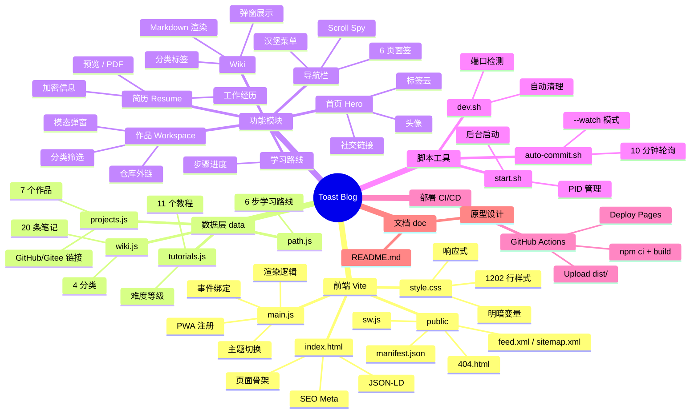

# Toast Blog · 项目文档

> 作者：简单的李
> 仓库：https://github.com/sml-toast/toast-blog
> 在线：https://sml-toast.github.io/toast-blog/
> 最后更新：2026-06-16

---

## 一、项目目的

个人技术博客 + 作品集网站。展示简历、开源作品、技术教程、知识笔记（Wiki）和学习路线。

## 二、项目架构图

```
┌─────────────────────────────────────┐
│          Toast Blog (Vite)           │
├─────────────────────────────────────┤
│  ┌───────────────────────────────┐  │
│  │       SPA 单页应用              │  │
│  │  index.html → main.js → style  │  │
│  └───────────┬───────────────────┘  │
│              │                      │
│  ┌───────────┴───────────────────┐  │
│  │       页面板块 (Section)        │  │
│  │  Home → 首页 / Hero           │  │
│  │  Resume → 简历                │  │
│  │  Workspace → 作品展示          │  │
│  │  Tutorials → 教程             │  │
│  │  Wiki → 知识笔记              │  │
│  │  Learning Path → 学习路线      │  │
│  └───────────────────────────────┘  │
│                                      │
│  ┌───────────────────────────────┐  │
│  │       数据层 (data/)          │  │
│  │  projects.js · tutorials.js   │  │
│  │  wiki.js · path.js            │  │
│  └───────────────────────────────┘  │
│                                      │
│  ┌───────────────────────────────┐  │
│  │        构建 & 部署             │  │
│  │  Vite build → dist/           │  │
│  │  GitHub Actions → Pages       │  │
│  └───────────────────────────────┘  │
└─────────────────────────────────────┘
```

## 三、模块图

| 模块 | 职责 | 文件 |
|------|------|------|
| **导航** | 6 页面签切换、Scroll Spy 高亮 | index.html `<nav>` |
| **首页** | 头像、自我介绍、社交链接 | `#home` section |
| **简历** | 加密信息栏、工作经历、技能标签、预览/导出 PDF | `#resume` section |
| **作品** | 分类筛选（AI/Web/工具）、弹窗详情、GitHub/Gitee 链接 | `#workspace` + `#projectGrid` |
| **教程** | 教程卡片展示 | `#tutorials` + `#tutorialGrid` |
| **Wiki** | 分类筛选、Markdown 弹窗渲染 | `#wiki` + `#wikiCategories` |
| **学习路线** | 步骤进度展示 | `#learning-path` + `#learningPath` |
| **主题切换** | 明/暗切换，localStorage 持久化 | `theme-toggle-btn` |
| **骨架屏** | 加载动画 | `data-skeleton` cards |
| **模态框** | 作品/Wiki 详情弹窗，ESC 关闭 | `#modalOverlay` |
| **回到顶部** | 滚动 ≥300px 显示 | `back-to-top` |
| **PWA** | Service Worker 缓存 | `public/sw.js` |
| **SEO** | JSON-LD、Sitemap、RSS、OG/Twitter 卡片 | `<head>` |

## 四、思维导图



## 五、代码树

```
toast-blog/
├── index.html              # 主页面 (所有 Section)
├── main.js                 # 核心 JS 逻辑
├── style.css               # 全局样式 (1202 行)
├── vite.config.js          # Vite 配置
├── package.json            # NPM 依赖
├── .gitignore              # Git 忽略规则
├── .github/
│   └── workflows/
│       └── deploy.yml      # GitHub Pages 自动部署
├── data/
│   ├── projects.js         # 作品数据 (7 个)
│   ├── tutorials.js        # 教程数据 (11 个)
│   ├── wiki.js             # Wiki 数据 (20 条)
│   └── path.js             # 学习路线数据 (6 步)
├── public/
│   ├── 404.html            # 404 页面
│   ├── feed.xml            # RSS
│   ├── manifest.json       # PWA Manifest
│   ├── robots.txt          # 爬虫规则
│   ├── sitemap.xml         # 站点地图
│   ├── sw.js               # Service Worker
│   └── project-thumbs/     # 作品缩略图 SVG
│       ├── ai-cs.svg
│       ├── lowcode.svg
│       ├── create-toast.svg
│       ├── flowforge.svg
│       ├── toast-ui.svg
│       ├── agent-forge.svg
│       └── devbox.svg
├── scripts/
│   ├── dev.sh              # 开发启动
│   ├── start.sh            # 后台启动
│   ├── stop.sh             # 停止
│   ├── auto-commit.sh      # 自动提交
│   └── com.toastblog.autocommit.plist  # macOS 定时任务
├── dist/                   # 构建产物
├── doc/
│   ├── README.md           # ← 本文档
│   ├── .gitignore
│   ├── gen.py
│   ├── generate_blog.py
│   └── test.txt
├── DEVELOPMENT_PLAN.md     # 开发计划
└── DEVELOPMENT_LOG.md      # 开发日志
```

## 六、本地启动命令

```bash
# 1. 安装依赖
npm install

# 2. 启动开发服务器 (端口自动检测)
npm run dev

# 3. 构建生产版本
npm run build

# 4. 预览构建产物
npm run preview
```

### 可用脚本

| 脚本 | 功能 |
|------|------|
| `npm run dev` 或 `bash scripts/dev.sh` | 启动 Vite 开发服务器 |
| `bash scripts/dev.sh 5174` | 指定端口启动 |
| `bash scripts/start.sh` | 后台持久运行 |
| `bash scripts/stop.sh` | 停止后台进程 |
| `bash scripts/auto-commit.sh` | 自动检测变更并提交 |
| `bash scripts/auto-commit.sh --watch` | 每 10 分钟轮询提交 |

## 七、服务器部署

### GitHub Pages

```yaml
# .github/workflows/deploy.yml
# Push 到 main 分支自动触发：
# 1. npm ci + npm run build
# 2. 上传 dist/ 到 Pages
# 3. 部署到 https://sml-toast.github.io/toast-blog/
```

**手动触发：**
```bash
npm run build
# 推送 main 分支 → GitHub Actions 自动部署
```

**GitHub Pages 配置：**
- Source: GitHub Actions
- 域名: https://sml-toast.github.io/toast-blog/（待修复）
- 需要配置 Pages 自定义域名或等待 Actions 部署完成

## 八、开发任务 & 进度

| # | 任务 | 状态 |
|---|------|------|
| 1 | Vite 初始化 + 6 板块 HTML 骨架 | ✅ |
| 2 | 深色模式、入场动画、返回顶部、ESC关闭、汉堡菜单 | ✅ |
| 3 | 内容填充（Wiki 20 + 教程 11 + 作品 7 + 简历） | ✅ |
| 4 | Lighthouse P100 性能优化 | ✅ |
| 5 | SEO/JSON-LD/Sitemap/RSS/PWA/Giscus/GitHub Actions | ✅ |
| 6 | GitHub Pages 部署 + Logo 设计 | ✅ |
| 7 | 工作台弹窗修复 + 简历功能补齐 | ✅ |
| 8 | 打印 PDF 优化 | ✅ |
| 9 | 后台管理面板 (Iter 7) — 加密 CRUD + 导入导出 | ✅ |
| 10 | 环境切换 DEV/TEST/PROD + 配色动效 | ✅ |
| 11 | 数据目录重构 data/{dev,test,pro}/ + 附件归档 | ✅ |
| 12 | 多语言 i18n — 中英文语言包 + 前台切换 + 后台配置 | ✅ |
| 13 | 登录缓存 localStorage + 30min 过期 | ✅ |
| 14 | 页面动效增强 | 🔲 |
| 15 | 图片懒加载 | 🔲 |

## 九、测试任务 & 进度

| # | 测试项 | 状态 |
|---|--------|------|
| 1 | 页面标题正确 | ✅ |
| 2 | 导航标签切换 | ✅ |
| 3 | 作品分类筛选 + 弹窗 + ESC 关闭 | ✅ |
| 4 | Wiki 分类筛选 + Markdown 弹窗 | ✅ |
| 5 | 主题切换持久化 | ✅ |
| 6 | 回到顶部 + 汉堡菜单 | ✅ |
| 7 | 简历加密切换 + 预览 + PDF | ✅ |
| 8 | 语言切换 (🇨🇳🇺🇸) + 后台 i18n 配置 | ✅ |
| 9 | 环境切换 (DEV/TEST/PROD) 配色 + 数据隔离 | ✅ |
| 10 | 登录缓存 (30min 过期 + 退出清除) | ✅ |
| 11 | 备份/还原/导出/导入 | ✅ |
| 12 | GitHub Pages 可访问 | ✅ |
| 13 | Playwright 自动化测试 (16/16) | ✅ |

## 十三、新增功能 (2026-06-18)

### 13.1 登录缓存
- `localStorage` 存储登录状态，30 分钟过期
- 退出按钮清除所有缓存
- 页面刷新不丢失登录，超时自动过期

### 13.2 环境切换 (DEV / TEST / PROD)
- 三环境数据隔离，各自独立的 localStorage key
- 色块标签：DEV 🟢 / TEST 🟠 / PROD 🔵
- 切换时加载动画反馈
- 当前环境高亮显示
- 切换后仪表盘/表格/数据全面刷新
- 后台 i18n 配置可控制开关

### 13.3 数据目录结构
```
data/
├── dev/         ← 开发环境
│   ├── manifest.json    ← 文件清单
│   ├── data.json        ← 数据备份
│   └── attachments/     ← 附件原始文件
│       └── YYYY-MM/     ← 按月归档
├── test/        ← 测试环境（同 dev）
├── pro/         ← 生产环境（同 dev）
├── backups/     ← 时间戳备份快照
│   ├── dev/YYYY-MM-DD_HHMMSS/
│   ├── test/...
│   └── pro/...
├── lang/        ← i18n 语言包
│   ├── zh-CN.json
│   └── en.json
├── i18n.js      ← 多语言引擎
├── loader.js    ← 数据加载层
└── raw/         ← 旧原始数据（逐步迁移）
```

### 13.4 多语言功能 (i18n)
| 模块 | 说明 |
|------|------|
| 语言包 | `data/lang/zh-CN.json` / `en.json` |
| 引擎 | `data/i18n.js` — 加载/切换/翻译/持久化 |
| 前台 | 导航栏右上角 🇨🇳🇺🇸 切换 |
| 后台 | 🌐 多语言页签 — 启用/默认/支持语言 |
| 技术 | `export` + `window` 双绑定，支持未来扩展 |

### 13.5 开发日志
每完成一个功能自动记录到 `DEVELOPMENT_LOG.md`，包含：
- 功能名称与状态
- 核心改动描述
- 测试结果

## 十、开发工具

| 工具 | 用途 |
|------|------|
| Vite 6 | 构建工具 |
| VS Code / Cursor | 编辑器 |
| Chrome DevTools + Lighthouse | 调试 & 审计 |
| Figma | 原型设计 |
| GitHub Actions | CI/CD |
| html2pdf.js (CDN) | PDF 导出 |
| Lucide Icons | 图标库 |
| Giscus | 评论区 |

## 十一、测试工具

| 工具 | 用途 |
|------|------|
| Playwright | E2E 浏览器自动化测试 (16项全部通过) |
| Chrome Lighthouse | 性能/SEO/可访问性审计 (Lighthouse P100) |
| 手动测试 | 功能完整性验证 |
| Node.js `--check` | JS 语法校验 |
| GitHub Actions CI | 自动构建+部署验证 |

## 十二、测试脚本

```bash
# 启动开发服务器
npm run dev

# 手动测试清单：
# 1. 首页 - 标题、导航、滚动
# 2. 简历 - 加密切换、预览、PDF
# 3. 作品 - 筛选、弹窗、仓库链接
# 4. 教程 - 卡片展示
# 5. Wiki - 分类、弹窗内容
# 6. 学习路线 - 步骤展示
```
